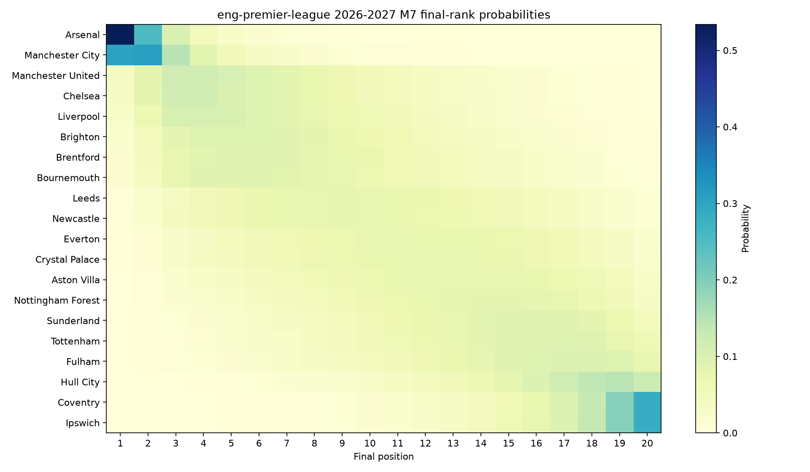
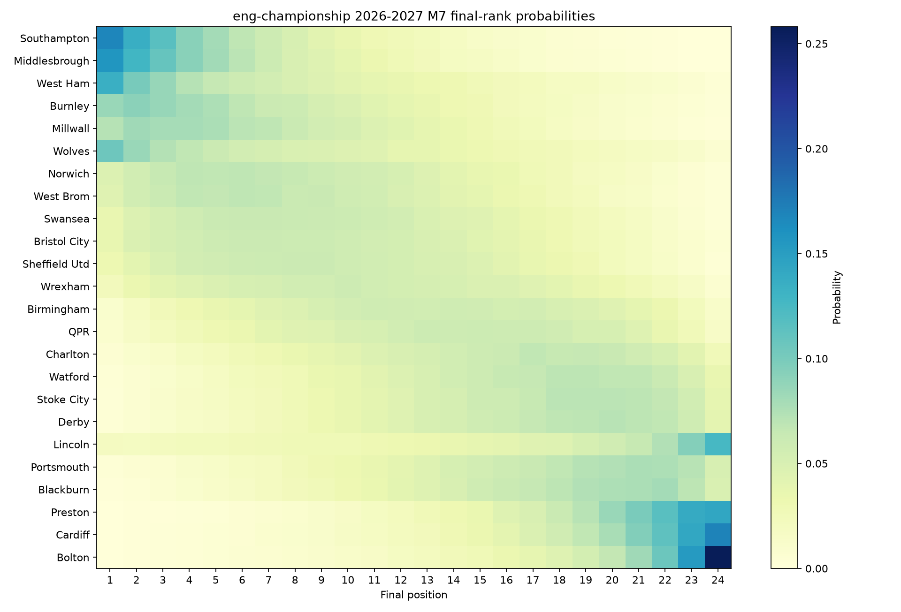

# Current M7 season projection

Information cutoff: `2026-09-10T17:30:09.545398+00:00`. Simulations: 50,000. Seed: 20260910.
M7 is the primary structural surface; market pooling is not used.

## Premier League

| Team | Exp rank | Median | 90% rank | Exp pts | 90% pts | Title | Top five | Relegation |
| --- | ---: | ---: | ---: | ---: | ---: | ---: | ---: | ---: |
| Arsenal | 1.95 | 1 | 1–5 | 78.4 | 63–93 | 53.4% | 96.2% | 0.0% |
| Manchester City | 2.78 | 2 | 1–7 | 74.0 | 58–89 | 30.4% | 89.6% | 0.0% |
| Manchester United | 6.80 | 6 | 2–15 | 60.5 | 45–76 | 3.5% | 45.5% | 1.0% |
| Chelsea | 6.87 | 6 | 2–15 | 60.6 | 45–77 | 3.1% | 44.6% | 1.1% |
| Liverpool | 7.29 | 7 | 2–15 | 59.3 | 44–75 | 2.6% | 40.4% | 1.4% |
| Brighton | 7.99 | 7 | 2–16 | 57.6 | 42–73 | 1.8% | 33.4% | 2.2% |
| Brentford | 8.33 | 8 | 2–16 | 56.9 | 41–73 | 1.6% | 30.5% | 2.5% |
| Bournemouth | 8.39 | 8 | 2–16 | 56.7 | 41–73 | 1.4% | 30.6% | 2.8% |
| Leeds | 10.05 | 10 | 3–18 | 53.2 | 38–69 | 0.6% | 18.0% | 5.4% |
| Newcastle | 10.07 | 10 | 3–18 | 53.0 | 38–69 | 0.6% | 18.0% | 5.4% |
| Everton | 11.30 | 11 | 4–18 | 50.4 | 35–66 | 0.3% | 11.8% | 9.1% |
| Crystal Palace | 11.40 | 12 | 4–19 | 50.3 | 35–66 | 0.3% | 11.8% | 9.6% |
| Aston Villa | 12.13 | 12 | 4–19 | 48.6 | 33–64 | 0.2% | 8.7% | 12.8% |
| Nottingham Forest | 12.68 | 13 | 5–19 | 47.3 | 32–63 | 0.1% | 6.8% | 15.5% |
| Sunderland | 13.43 | 14 | 6–19 | 45.8 | 31–61 | 0.1% | 4.9% | 19.2% |
| Tottenham | 13.81 | 14 | 6–20 | 44.9 | 30–61 | 0.1% | 4.1% | 22.4% |
| Fulham | 14.26 | 15 | 6–20 | 43.7 | 28–59 | 0.1% | 3.3% | 26.3% |
| Hull City | 15.81 | 17 | 8–20 | 40.2 | 26–55 | 0.0% | 1.1% | 40.9% |
| Coventry | 17.31 | 18 | 11–20 | 35.6 | 21–51 | 0.0% | 0.4% | 61.2% |
| Ipswich | 17.33 | 18 | 11–20 | 35.7 | 22–51 | 0.0% | 0.4% | 61.3% |

## Championship

| Team | Exp rank | Median | 90% rank | Exp pts | 90% pts | Auto | Playoff | Promotion | Relegation |
| --- | ---: | ---: | ---: | ---: | ---: | ---: | ---: | ---: | ---: |
| Southampton | 5.68 | 4 | 1–15 | 76.9 | 59–95 | 30.3% | 46.7% | 41.6% | 0.3% |
| Middlesbrough | 5.92 | 5 | 1–15 | 76.8 | 59–95 | 28.5% | 46.5% | 37.4% | 0.3% |
| West Ham | 7.64 | 6 | 1–19 | 73.4 | 52–95 | 23.6% | 38.8% | 30.9% | 2.0% |
| Burnley | 7.90 | 7 | 1–19 | 72.2 | 53–91 | 17.6% | 43.2% | 28.2% | 1.4% |
| Millwall | 8.09 | 7 | 1–18 | 71.8 | 54–90 | 15.4% | 43.4% | 22.7% | 1.1% |
| Wolves | 8.71 | 7 | 1–21 | 71.0 | 49–93 | 19.1% | 35.9% | 25.8% | 3.4% |
| Norwich | 9.25 | 9 | 2–19 | 69.3 | 52–87 | 10.2% | 39.6% | 16.6% | 1.7% |
| West Brom | 9.28 | 9 | 2–19 | 69.4 | 52–87 | 10.0% | 39.3% | 15.5% | 1.5% |
| Swansea | 9.94 | 9 | 2–20 | 67.9 | 51–86 | 8.3% | 36.1% | 13.3% | 2.1% |
| Bristol City | 10.10 | 10 | 2–20 | 67.8 | 50–86 | 8.5% | 35.0% | 13.4% | 2.5% |
| Sheffield Utd | 10.38 | 10 | 2–20 | 67.1 | 50–85 | 7.3% | 34.0% | 12.7% | 2.7% |
| Wrexham | 11.38 | 11 | 2–21 | 65.1 | 47–83 | 5.7% | 29.4% | 10.2% | 4.5% |
| Birmingham | 12.94 | 13 | 3–22 | 62.2 | 45–80 | 2.8% | 22.0% | 5.7% | 6.8% |
| QPR | 13.50 | 14 | 4–22 | 61.2 | 44–79 | 2.4% | 19.5% | 4.6% | 7.6% |
| Charlton | 14.81 | 15 | 5–23 | 58.9 | 42–76 | 1.5% | 14.4% | 3.0% | 11.9% |
| Watford | 15.55 | 16 | 6–23 | 57.3 | 41–75 | 0.9% | 11.6% | 2.3% | 14.7% |
| Stoke City | 15.72 | 17 | 5–23 | 56.9 | 40–75 | 1.0% | 11.3% | 2.3% | 16.0% |
| Derby | 15.81 | 17 | 6–23 | 56.7 | 40–74 | 0.9% | 10.8% | 2.4% | 16.5% |
| Lincoln | 16.05 | 18 | 3–24 | 55.0 | 31–81 | 3.9% | 14.4% | 6.3% | 29.4% |
| Portsmouth | 16.37 | 17 | 6–24 | 55.5 | 38–73 | 0.9% | 9.5% | 2.0% | 19.8% |
| Blackburn | 16.51 | 17 | 6–23 | 55.2 | 38–73 | 0.6% | 8.9% | 1.6% | 19.8% |
| Preston | 19.21 | 20 | 10–24 | 49.2 | 33–67 | 0.1% | 3.0% | 0.5% | 39.8% |
| Cardiff | 19.31 | 21 | 10–24 | 48.6 | 31–67 | 0.2% | 3.4% | 0.5% | 42.5% |
| Bolton | 19.94 | 22 | 10–24 | 46.3 | 27–67 | 0.2% | 3.3% | 0.7% | 51.7% |

## Matched uncertainty sensitivity

Distances compare each rank PMF with full M7. The Monte Carlo row is an independent full-M7 rerun; `teams above noise` counts Wasserstein distances larger than that team’s rerun distance.

| Competition | Variant | Median rank W1 | Max rank W1 | Mean 90% width change | Teams above noise |
| --- | --- | ---: | ---: | ---: | ---: |
| eng-premier-league | no_future_innovations | 0.137 | 0.201 | -0.45 | 20/20 |
| eng-premier-league | posterior_mean | 0.337 | 0.502 | -1.00 | 20/20 |
| eng-premier-league | promoted_posterior_mean | 0.054 | 0.275 | -0.30 | 17/20 |
| eng-championship | no_future_innovations | 0.118 | 0.212 | -0.29 | 23/24 |
| eng-championship | posterior_mean | 0.577 | 1.949 | -2.00 | 24/24 |

The full CSV reports team-level expected-rank changes, 50/80/90% width changes, event-probability changes, Wasserstein distance and total variation, with Monte Carlo-noise flags.

Championship postseason probabilities simulate the edition-specific bracket after every regular-season path. The retained rules do not resolve extra-time probabilities, neutral-site scoring, or semi-final leg order, so the explicit approximations recorded in the JSON remain part of the forecast definition.
