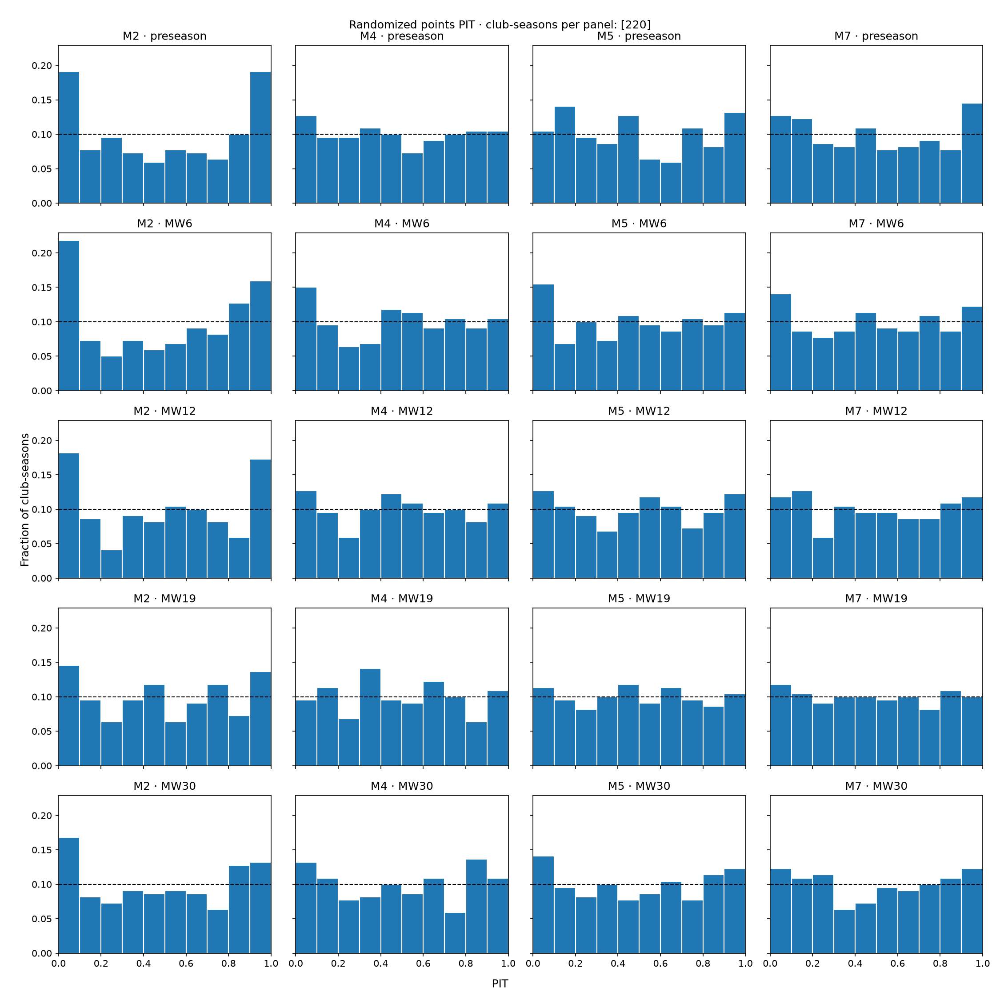
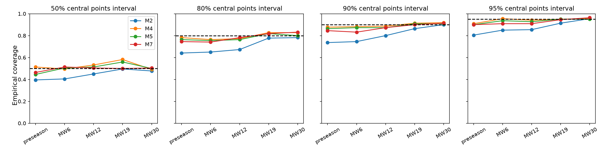
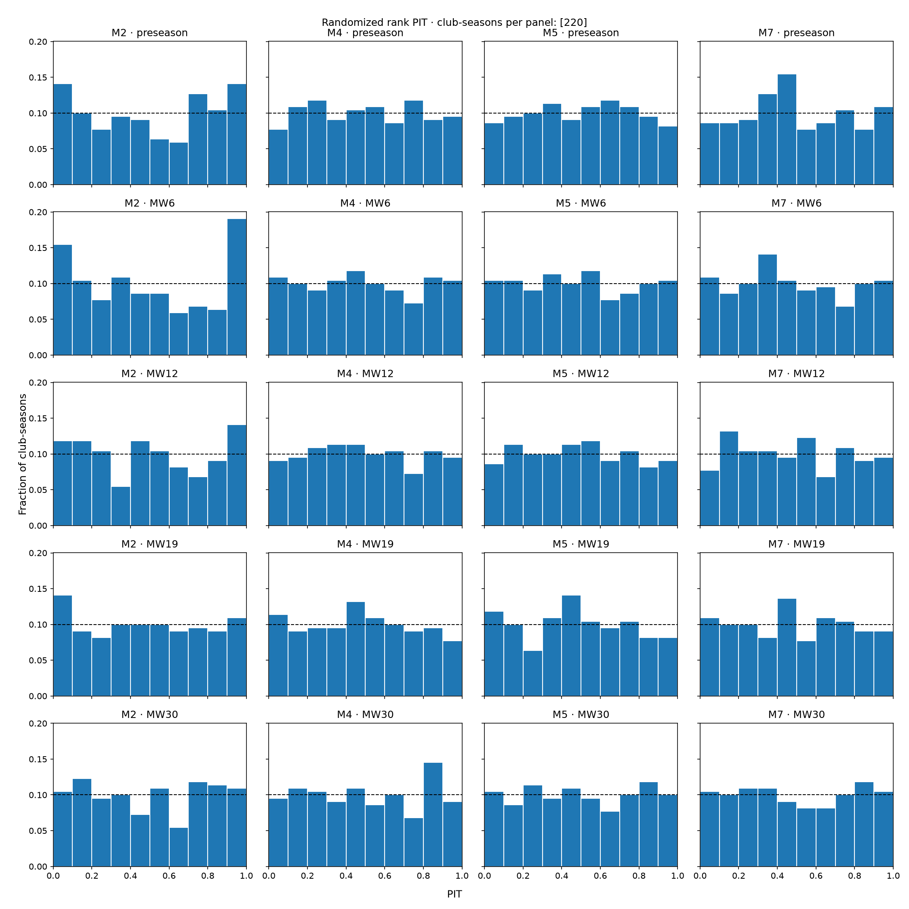
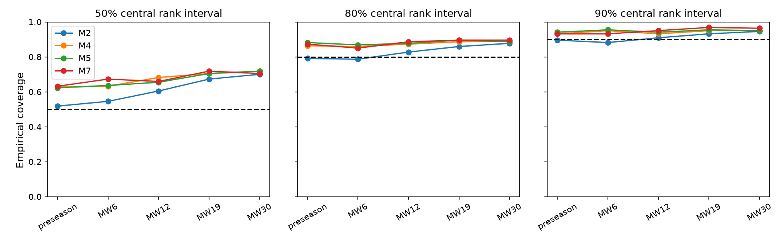
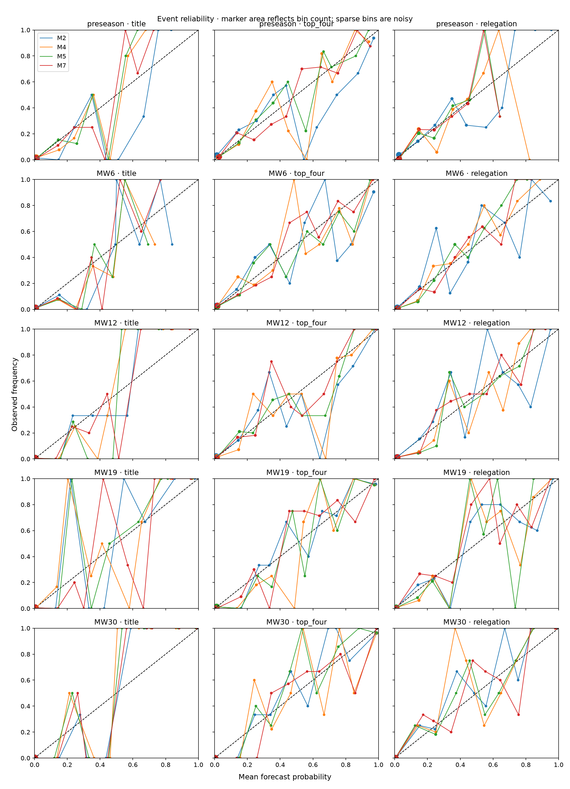

# Season projections: M2, M4, M5 and M7

M2's preseason points intervals are materially too narrow. Across 220 club-seasons
in 2015/16–2025/26, its nominal 90% interval covers only 73.6% of final totals.
M4, M5 and M7 improve both preseason rank RPS and points CRPS, with much
better coverage. Match-level loss alone missed this product-level distinction.

The complete panel contains 220 forecasts: four retained model specifications,
11 seasons, five origins and 10,000 simulations per forecast. Scores pool 220
club-seasons per model-origin, yielding 4,400 scored rows in total. There was no
parameter tuning for this comparison. All results are retrospective development
evidence. See the [methodology and commands](../season_evaluation.md).

## Preseason points and standings

| Model | Rank RPS ↓ | Points CRPS ↓ | Points RMSE | Mean points SD | 90% coverage | Promoted bias |
| --- | --- | --- | --- | --- | --- | --- |
| M2 | 0.11049 | 6.759 | 11.61 | 7.56 | 73.6% | +6.91 |
| M4 | 0.10720 | 6.476 | 11.42 | 10.60 | 87.7% | +1.28 |
| M5 | 0.10684 | 6.531 | 11.51 | 10.08 | 86.4% | +2.27 |
| M7 | 0.10629 | 6.578 | 11.57 | 9.73 | 84.5% | +2.82 |

M2 reproduces the reported 11.6-point RMSE and +6.9-point promoted-club bias;
it overpredicts promoted clubs in 24 of 33 cases. Its aggregate preseason bias
is only +0.05 points, illustrating why aggregate mean error is insufficient.
M4 reduces promoted-club bias to +1.28 points and overprediction to 18 of 33 cases.
M5 and M7 overpredict in 19 of 33 cases.

For promoted clubs alone, preseason 90% coverage is 60.6% for M2, 84.8% for M4,
and 87.9% for both M5 and M7. Their points CRPS values are 8.379, 7.080, 7.368
and 7.424, respectively. Full [subgroup scores](season_scoring/subgroups.csv)
include promoted clubs and incumbents at every origin.

## Scores across origins

Rank RPS, lower is better:

| Origin | M2 | M4 | M5 | M7 |
| --- | --- | --- | --- | --- |
| preseason | 0.11049 | 0.10720 | 0.10684 | 0.10629 |
| MW6 | 0.09460 | 0.09238 | 0.09154 | 0.09055 |
| MW12 | 0.07811 | 0.07885 | 0.07872 | 0.07671 |
| MW19 | 0.05890 | 0.06024 | 0.05952 | 0.05849 |
| MW30 | 0.04115 | 0.04248 | 0.04200 | 0.04143 |

Points CRPS, lower is better and measured in points:

| Origin | M2 | M4 | M5 | M7 |
| --- | --- | --- | --- | --- |
| preseason | 6.759 | 6.476 | 6.531 | 6.578 |
| MW6 | 5.678 | 5.471 | 5.486 | 5.440 |
| MW12 | 4.671 | 4.603 | 4.671 | 4.559 |
| MW19 | 3.457 | 3.455 | 3.466 | 3.392 |
| MW30 | 2.194 | 2.222 | 2.230 | 2.164 |

M7 has the lowest measured rank RPS at preseason, MW6, MW12 and MW19; M2 has the
lowest at MW30. M4 has the lowest preseason points CRPS, while M7 has the lowest
at every later origin. M4/M5's early improvements do not persist uniformly:
both score worse than M2 on rank RPS from MW12 onward.

The pooled point estimates do not establish a universal winner. The paired
season-cluster 95% bootstrap intervals for every preseason rank RPS and points CRPS
difference versus M2 include zero. For example, M4's points CRPS difference is
−0.283 [−0.737, +0.147], and M7's rank RPS difference is −0.00419
[−0.01522, +0.00497]. All [paired comparisons](season_scoring/paired_comparisons.csv)
and [per-season scores](season_scoring/by_season.csv) are retained. Pooling clubs
improves the score estimate but does not turn 11 title outcomes into 220
independent title outcomes; uncertainty resamples whole seasons.

## Calibration and headline events

Nominal 90% points interval coverage:

| Origin | M2 | M4 | M5 | M7 |
| --- | --- | --- | --- | --- |
| preseason | 73.6% | 87.7% | 86.4% | 84.5% |
| MW6 | 74.5% | 88.2% | 87.3% | 83.2% |
| MW12 | 80.0% | 88.6% | 87.3% | 87.3% |
| MW19 | 86.4% | 91.4% | 90.9% | 90.0% |
| MW30 | 90.0% | 91.8% | 90.9% | 91.4% |

M2's preseason PIT histogram has excess mass in both extreme bins, consistent
with underdispersion. The uncertainty-aware models substantially reduce that
pattern. M2's central coverage improves as matches are played; at MW30 its
90% coverage reaches 90%. Discrete inclusive intervals can cover above nominal.
All 50%, 80%, 90% and 95% coverages and widths are in the
[pooled summary](season_scoring/summary.csv).

Final-rank distributions are now scored directly. At preseason, M2's mean rank SD
is 3.05 positions and its central 50/80/90% rank intervals cover 51.8%, 79.1% and
89.5%, with average widths 4.28, 7.86 and 9.71 positions. M4/M5/M7 are wider and
overcover at all three levels: their preseason 90% coverage is 93.2%, 94.1% and
93.2%, with widths 11.69, 12.04 and 11.93. Rank RPS still improves, so the wider
distributions buy useful calibration rather than dispersion alone.

Preseason headline-event Brier scores, lower is better:

| Model | Title | Top-four | Relegation |
| --- | --- | --- | --- |
| M2 | 0.03073 | 0.09408 | 0.09880 |
| M4 | 0.03092 | 0.09183 | 0.09395 |
| M5 | 0.03071 | 0.08913 | 0.09627 |
| M7 | 0.02918 | 0.08753 | 0.09771 |

M7 has the lowest top-four Brier score at all five origins. M2 has the lowest
title Brier score from MW12 onward and the lowest relegation Brier score at MW19
and MW30. The curves therefore need to be read by event and origin. Bin counts
are retained in [calibration.csv](season_scoring/calibration.csv); high-probability
title bins are sparse, and their observed rates are noisy.

## Interpretation and limits

Season distribution scores now belong in model-promotion evidence. M2's early
points intervals should not be described as calibrated, and M4/M5's uncertainty
capabilities should not be dismissed using near-equal H/D/A loss. M7's season
ranking and top-four results also strengthen the case for its retained research
status. Together with the matched match scoreboard, these measurements select M7
for the structural MVP: it leads retained match models, has the best rank RPS at
four of five origins and the best points CRPS after preseason. M2 remains the
operational benchmark, and M4's better preseason points CRPS remains a visible
tradeoff rather than being erased by the product choice.

This comparison does not isolate the causal effect of parameter uncertainty or
state evolution: the models also differ in training history, promotion priors,
score likelihood and xG information. A matched fixed-state ablation would be
needed for that attribution. Small differences can also reflect finite simulation
error. The bootstrap treats seasons as exchangeable clusters; it does not model
serial dependence between years and is exploratory with 11 clusters.

MW labels are match-count proxies, not official scheduled rounds: the next day
after 60/120/190/300 completed matches, including the whole day's results. Actual
cutoffs and counts are in every [club-origin row](season_scoring/club_seasons.csv).
Future fixture dates are retrospective; M7 xG availability is reconstructed.
Forecast sanctions are restricted to those known at the origin; realized outcomes
include final sanctions. These are not archived prospective forecasts.

## Reproduction and verification

The [compressed marginals](season_scoring/forecast_marginals.json.gz) contain all
220 forecasts' points and rank distributions, all 11 realized tables, promotion
labels and original full-forecast hashes. The rescore command in the methodology
reproduces every score and calibration bin without fitting models or loading raw
data. The [score manifest](season_scoring/manifest.json) pins that archive and the
final scorer. Generation manifests retain the original full-panel invocation
and the two independent late-season jobs. The exact original runner is retained
as [text](season_scoring/evaluation_runner.txt); its later formatting does not
change its syntax tree. The final PIT randomizer uses a separate seeded stream
from the forecast simulations.

Validation: the current repository verifier passes. Archive rescoring,
complete panel sizes, probability conservation, final event counts, promotion
counts and paired-model matching were checked. All full simulation artifacts
remain locally under `runs/season-scoring-v1`, `runs/season-scoring-2024` and
`runs/season-scoring-2025`; final rescored tables are in `runs/season-scoring-final`.
